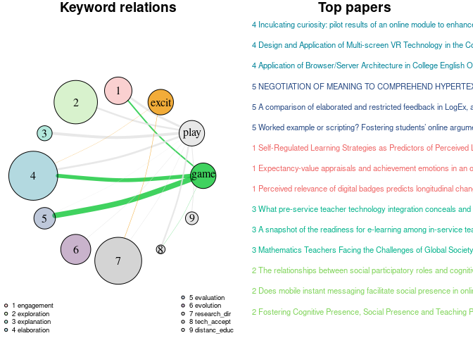

# knowledge-hub-learning-analytics
literature review and bibliography collection to online learning, shiny apps and other topics in learning analytics.

# Online learning apps from the learning cycle perspective: recent advances and best practices

## Introduction

Online learning applications with a large proportion of interactive,
self-chosen content for individual learning paths become more and more
essential in higher education. Especially, the lockdown during the
COVID-19 pandemic enhanced a boom in the usage of such online learning
applications and empirical studies of their effectiveness.

In their meta analysis of more than 50 publications with randomized or
quasi-randomized experiments on online, blended, and face-to-face
learning Means et al. ([2010](#ref-means2010)) report significant
improvement in learning outcomes for online and blended formats. Some
more recent meta studies report superiority of flipped classroom
approach compared to traditional learning.

A natural approach to designing active learning units in asynchronous
online and blended settings is the flipped classroom technique which
outperforms the classical lecturing approach in numerous studies (Ying
and Thompson ([2020](#ref-xiu2020)) and Shi et al.
([2019](#ref-shi2020))). Hew et al. ([2020](#ref-hew2020)) propose
designing fully online flipped classroom wit online meeting instead of
face-to-face one. Recent literature on MOOCs and small online courses
(cite) underpin that even fully asynchronous online learning can be
effective provided the course activities and materials are designed to
meet students needs.

The purpose of the present paper is to review the recent advances and
best practices for designing online learning units. Our primary goal is
to identify effective parts and elements of online learning units
essential for learning success and formulate recommendations for
developing a such asynchronous online learning applications.

According to the taxonomy of Cooper ([1988](#ref-Cooper1988)), our main
focus rests on research outcomes. That is, we are interested primarily
in identification of the features of computer aided online learning
environments that provably improve learning performance and experience.
Best practices of using those features are also of major interest in our
analysis. Finally, since generalization of the findings to other
teaching domains is favorable, we also overview the underlying
behavioral theories where possible.

Our perspective is a neutral semi-automatic filtration and
representation of available published literature according to our
specific criteria provided below.

To pivot/structure our analysis, we adopt a 5E instructional framework,
where designing of learning units follows the five-phase learning cycle:
Engage, Explore, Explain, Elaborate, and Evaluate described in Bybee et
al. ([2006](#ref-bybee2006)) and Hew et al. ([2020](#ref-hew2020)). The
first phase aims at engaging students e.g. by pointing out to real world
problem or question, the second phase deals with the exploration of the
problem, the next step attempts at explaining the phenomena based on
existing knowledge, elaborating the content implies providing material
for deeper understanding and exercising, and the last step evaluates
learning success. Su, Chiu, and Wang ([2010](#ref-su2010)) use 5E
learning cycle for designing an e-learning course and show that they
enhance learning success.

Since modern e-learning systems incorporate adaptation or personalizing
feature, we propose to extend the 5E model to 5E+E by adding the “6
Evolution”-step. This step does not concern the learning cycle itself
but rather includes the analysis of learning system usability and
improvement considerations towards developing an adaptive personalized
e-learning system, which adapts to individual learning preferences. In
the following, we undertake a more detailed overview of the learning
cycle phases.

**Engagement.** Various definitions of student engagement exist. For
instance, Hu, Kuh, and Li ([2008](#ref-hu2008)) understand engagement as
“the amount of effort dedicated to educational activities that bring out
ideal performance”. A. Lewis et al. ([2010](#ref-lewis2011)) see
engagement as “the extent to which learners’ thoughts, feelings, and
activities are actively involved in learning”.

Wong and Liem ([2022](#ref-wong2022)) define learning engagement as
“students’ psychological state of activity that affords them to feel
activated, exert effort, and be absorbed during learning activities”.
Based on known theories about the concept, they differentiate between
behavioral, cognitive and emotional components in engagement assessment.
The authors view learning engagement as a multilevel construct varying
with learning context and time. In this sense, engagement is
superordinate to the other stages as it nurtures carrying out the
learning activities.

Lee, Song, and Hong ([2019](#ref-lee2019)) identify the following
aspects as indicators of engagement: 1) behavioral - learning effort
(self completed units, invested time), participation in class activities
(attendance, asking questions), interaction (between learner and
instructor), 2) cognitive task - solving (knowledge formation,
application, reflection/believes about achievement, focus), learning
management (self-direction, schedule), 3) emotional - learning
satisfaction (interest, expectations, enjoyment), sense of belonging
(degree of connection in the learning community), learning passion
(willingness to confront challenges in the learning process).

Skilling, Bobis, and Martin ([2020](#ref-skilling2020)) measures seven
adaptive factors as self-efficacy, mastery orientation, valuing,
persistence, planning, task management, and enjoyment and the five
maladaptive factor variables as anxiety, failure avoidance, uncertain
control, self-handicapping and disengagement to connect engagement,
motivation and achievement in particular towards secondary school
mathematics.

Maroco et al. ([2016](#ref-maroco2016)) develop a questionnaire in order
to address university students engagement. Assunção et al.
([2020](#ref-assuncao2020)) test the questionnaire and confirm that it
can produce reliable and valid data on academic engagement of university
students. Tomás et al. ([2022](#ref-jose2022)) assess reliability and
validity of further two self-assessment tools for quantifying
engagement.

**Exploration.** The exploration phase is exemplified in Bybee et al.
([2006](#ref-bybee2006)) through experimental activities, preliminary
investigation or using prior knowledge to generate new outcomes. Student
activities encompass e.g. stating and testing predictions and
hypotheses, trying alternatives and generating new ideas. Depending on
the subject, such activities can be implemented online through
interactive applications with manipulatives (e.g. varying input
parameters producing another output), simulations, and scenario-based
exploration. These “hands-on” experience has been shown to enhance
learning success in the literature, see Meylani, Bitter, and Legacy
([2015](#ref-meylani2015)). It is also connected to experiential
learning (see Morris ([2020](#ref-morris2020))), where concrete
experience is at core of the learning process.

**Explanation.** As Bybee et al. ([2006](#ref-bybee2006)), this stage
consists of providing new concepts or skills which serve as theoretical
basis for solving the stated problem or explaining observed phenomena.
In a purely online setting, where the instructor can not adapt to
learning preferences of the learners, different learning preferences
should be taken into account. Meylani, Bitter, and Legacy
([2015](#ref-meylani2015)) reviews works, where adding additional media
contributed to learning success. Learners should have a palette of
materials to acquire understanding of new concepts (as diagrams, videos,
text-based materials) as Katsaris and Vidakis
([2021](#ref-Katsaris2021)). Cite more learning styles in e-learning.

**Elaboration** As Bybee et al. ([2006](#ref-bybee2006)), elaboration
enhances deeper and broader understanding and application of new skills.
We interpret this stage also as the possibility for students to
intensively exercise and gain routinized skills in solving problems
associated with new concepts. Also, in asynchronous online learning,
where direct instructor feedback is not available, a self-testing
possibility with direct feedback should be provided as Meylani, Bitter,
and Legacy ([2015](#ref-meylani2015)). To engage students more in
exercising new concepts and attaining routinized skills, gamified
learning actovities can be used. As noted in Demmese, Yuan, and Dicheva
([n.d.](#ref-demmese2020)), such gamified activities can aid routine
practice motivating to solve more exercises.

**Evaluation** In this phase, ability assessment and the evaluation of
student progress takes place. In online format, individual ability
assessment is realized through quizzes with an end score. Meylani,
Bitter, and Legacy ([2015](#ref-meylani2015)) points out the importance
of self-monitoring in an online framework. An overview of completed
activities and attained test scores can be implemented in form of
learning analytics dashboard, which have been shown to enable learners
to making informed decisions (Susnjak, Ramaswami, and Mathrani
([2022](#ref-susnjak2022))).

**Evolution.** Evolve stage includes improving e-learning environment
based on direct feedback, questionnaire (as e.g. system usability scale,
J. R. Lewis ([2018](#ref-lewis2018))) and learning analytics and adding
personalized features. Meylani, Bitter, and Legacy
([2015](#ref-meylani2015)) stresses the importance of providing a form
of learner control over the available online resources. Based on
previous learning paths, an individual recommendation for each learner
might nehance learning success. As noted in Katsaris and Vidakis
([2021](#ref-Katsaris2021)) personalized e-learning environments
adapting to individual learning preferences are at rise. They have the
potential to support individual learning process optimally. For
instance, Fatahi ([2019](#ref-fatahi2019)) propose adaptation of
e-learning environments based on emotion and personality. Khamparia and
Pandey ([2020](#ref-khamparia2020)) review the methodologies, how
e-learning adaptation is realized based on automatic assessment of
learning styles and point out an overall utility for learners success.

Our coverage strategy is representative sample of papers available
through the OpenAlex API which indexes 209M works collected from various
sources as Crossref, PubMed and institutional and preprint repositories
as arXiv providing all together 124,000 publishing venues as Priem,
Piwowar, and Orr ([2022](#ref-priem2022openalex)).

For our analysis, we select articles published in the period from
2019-01-01 to 2023-03-31. The time frame was chosen so as to tie on the
comprehensive review in Martin, Sun, and Westine
([2020](#ref-martin2020)) covering works from 2009-2018 and the
identified twelve online learning research themes, to highlight their
development in subsequent years and to identify new topics.

We pivot our analysis based on citation intensity, concentrating on most
cited papers normalized on their age since publication. The results are
organized conceptually and are meant for general researchers and
practitioners.

We follow four steps of Herz et al. ([2010](#ref-herz2010)):

-   define the review scope
-   conceptualization of the topic (definitions of the topic: learning
    dashboards) -\> based on the previous review Matcha et al.
    ([2020](#ref-matcha2020))
-   literature search: journal search, database search, keyword search,
    backward (citations in the articles)/forward search (citations of
    the articles of keyword search)
-   literature analysis and synthesis (define main dimensions)

We obtain topic keywords following the definitions of the 5E stages from
three papers: Eisenkraft ([2003](#ref-eisenkraft2003)), Duran and Duran
([2004](#ref-duran2004)), and Bybee et al. ([2006](#ref-bybee2006)). For
the last stage of evolution, we adopt the descriptions of adaptive
e-learning environments from Özyurt and Özyurt
([2015](#ref-OZYURT2015)), El-Sabagh ([2021](#ref-el-sabagh2021)), and
Kolekar, Pai, and M M ([2019](#ref-kolekar2019)).

## Methods

### Searching and filtering the recent works on online learning

We search titles and abstracts of articles with publication date from
2015-01-01 to 2023-03-31 contained in the database OpenALex for keywords
“online learning”, “online teaching”, “e-learning”, “online course”,
“online education”, “education technology”, “computer assisted
learning”, “distance education” using the R-package openalexR (cite). As
a result, we obtain 106032 articles (as of 2023-04-17).

Subsequently, we filter the publisher to be under the top 20 ranking of
GoogleScholar in education, educational technology, and educational
psychology
(<https://scholar.google.com/citations?view_op=top_venues&hl=en&vq=eng_educationaltechnology>
(as of 2023-04-17)). The filtering yields 5474 articles.

Finally, we remove articles without abstracts available in the database,
and are left with 5089 articles for further analysis.

In the Figure above (upper panel) we plot the number of articles
in the selection on the time line of their publication date (2023 is
omitted, dashed line marks the mean value). The figure reveals a upward
general trend in publication number and a peak in 2021. In the bottom
panel of the previous Figure the average citation intensity,
computed as the number of citations divided by the years since
publication, is reported. The citation intensity of papers published in
2020 is the highest. Apart from 2020, the overall citation intensity
seems to stay fairly on the same level.

To efficiently incorporate all resulting articles in our analysis, we
employ an automatic topic identification via Latent Dirichlet Allocation
(LDA), which was also used in Gurcan ([2021](#ref-gurcan2021)) for
identification of emerging trends in e-learning. To target topics which
are of primary interest for researchers, Eshima, Imai, and Sasaki
([2023](#ref-eshima2023)) propose to equip the model with predefined
keywords.

For our analysis, we tie the keywords on the definitions and
descriptions of the 6E stages, such that the obtained topics are pivoted
by the learning cycle phases above. For that reason, a keyword assisted
LDA model is fitted to the data for keywords based topic extraction
using the R-Package keyATM (Eshima, Imai, and Sasaki
([2023](#ref-eshima2023))).

### Fiting keyATM

Table @ref(tab:tabkey) documents the provided keywords for the six
keyword topics. These keywords are used as input into keyword assisted
LDA model to facilitate targeted extraction of 5E+E structured topics.

| engagement | exploration | explanation | elaboration | evaluation | evolution |
|:-----------|:------------|:------------|:------------|:-----------|:----------|
| engag      | explor      | explain     | problem     | assess     | adapt     |
| motiv      | experi      | instruct    | solv        | evalu      | individu  |
| emot       | interact    | knowledg    | practic     | test       | improv    |
| promot     | activ       | theori      | applic      | feedback   | behavior  |

The chosen keywords for the six keyword topics to assist topic
extraction.

The figure below presents the chosen keywords with the respective
proportional occurrence on the titles and abstracts of the considered
collection of papers.

 

In the
following, we fit a keyword assisted topic model using the keywords
above for the six keyword topics and further three keywordless topics.

Based on screening the titles of the top 20 papers with the highest
topic proportion, we label the keywordless topics as 7. research
directions, 8. technology acceptance, and 9. challenges in distance
education (henceforth research_dir, tech_accept, and distanc_educ
respectively).

| 1_engagement | 2_exploration  | 3_explanation  | 4_elaboration  | 5_evaluation   | 6_evolution    | 7_research_dir | 8_tech_accept | 9_distanc_educ |
|:-------|:-------|:-------|:-------|:-------|:-------|:--------|:-------|:--------|
| self         | interact \[✓\] | teacher        | teach          | assess \[✓\]   | model          | research       | languag       | covid          |
| engag \[✓\]  | cours          | school         | develop        | group          | cours          | digit          | mobil         | pandem         |
| motiv \[✓\]  | social         | mathemat       | base           | effect         | system         | higher         | english       | face           |
| academ       | design         | instruct \[✓\] | design         | test \[✓\]     | mooc           | review         | accept        | distanc        |
| factor       | activ \[✓\]    | teach          | practic \[✓\]  | feedback \[✓\] | data           | develop        | intent        | teach          |
| effect       | discuss        | stem           | process        | evalu \[✓\]    | learner        | univers        | model         | univers        |
| level        | environ        | servic         | effect         | perform        | improv \[✓\]   | articl         | factor        | institut       |
| posit        | experi \[✓\]   | knowledg \[✓\] | applic \[✓\]   | peer           | base           | analysi        | perceiv       | higher         |
| signific     | learner        | develop        | comput         | read           | open           | paper          | attitud       | remot          |
| relat        | collabor       | profession     | method         | result         | qualiti        | literatur      | adopt         | lectur         |
| satisfact    | particip       | pre            | skill          | experiment     | behavior \[✓\] | inform         | influenc      | challeng       |
| relationship | support        | children       | problem \[✓\]  | control        | platform       | context        | toward        | faculti        |
| regul        | blend          | parent         | paper          | two            | analysi        | identifi       | research      | emerg          |
| influenc     | approach       | ict            | implement      | base           | individu \[✓\] | increas        | foreign       | experi \[2\]   |
| efficaci     | research       | program        | new            | score          | result         | need           | efl           | time           |
| perform      | instructor     | support        | result         | differ         | propos         | relat          | comput        | transit        |
| result       | engag \[1\]    | integr         | knowledg \[3\] | write          | perform        | futur          | devic         | survey         |
| emot \[✓\]   | class          | classroom      | integr         | compar         | user           | profession     | univers       | chang          |
| perceiv      | explor \[✓\]   | tpack          | tool           | intervent      | manag          | focus          | usag          | academ         |
| differ       | presenc        | secondari      | virtual        | signific       | adapt \[✓\]    | includ         | theori \[3\]  | due            |

The 20 topwords for each topic. The keywords matched on the respective
topic are marked by a check mark. The keywords in the topwords of a
foreign topic are label by the number of the keyword topic.

Table @ref(tab:tabtw) documents the resulting 20 topwords for each topic
with the keywords marked by a check mark. As seen, the most keywords are
under the top 20, giving appropriate assistance to the topic extraction.
The keyword, which are also under the top twenty in a foreign topic are
labeled by the keyword topic number. For example, “engag” was given as a
keyword for topic 1 engagement. However, it is also under the top 20 for
topic 2 exploration. Such interrelatedness of the keywords is relatively
rare under the top 20, which also supports appropriate assistance of the
keywords for the topic finding.

The next figure shows the expected topic proportions per paper
The largest topic proportions for keyword assisted topics fall on the
topics of elaboration and exploration followed by evolution. The
smallest expected proportion among the keyword assisted topics is
assigned to the explanation topic. From the keywordless topics, the
first one with the top words “research”, “digit”, “higher”, “review” is
dominating.

 In general,
the expected topic proportions are rather moderate, meaning that the
most papers contain more more than one topic with rather high
probability.

To inspect the topwords together with their relative weights in topics,
we provide word clouds with top 20 topic shaping words for each topic in
the figure below.

The wordclouds are based on the word weights
in the six keyword assisted topics: engagement, exploration,
explanation, elaboration, evaluation, evolution, as well as three
keywordless topics (from left to the right, from top to bottom).

The next figure shows the dynamics of topic proportions
summarized for the available publication years.

 In Figure
@ref(fig:figprop), we observe a slight increase in the literature on
engagement since 2021 and substantial increase in works on challenges in
distance education mainly due to pandemic restrictions in the period
2020-2021.

### Exploring the interrelations between topics

To further explore the interrelations between the documents with
different topics, we compute and plot the topic network with topics as
vertices and two different link types as edges. The first link type
deals with the expected topic proportion in documents with high
proportion of a vertices-topic. The higher this expected proportion is,
the thicker is the link line. For the computation top 100 documents
belonging to each topic are extracted. The first network is shown in the
left panel of the next figure. The second network type is based
on the reciprocal/mutual citations of top 100 documents belonging to
each topic. For the visualization of the network, we adjust the
thickness of the edges depending on the citation intensity. The
resulting network is shown on the right panel of the figure below.

plot network graph for citations (100 from topic 1 how many citations to
itself and to other topics)

plot  

In the left
panel, we see, that articles with high
proportion of engagement topic tend to contain a high proportion of
exploration issues and vice versa, as well as to relate to challenges on
distance education. Articles with high proportion of explanation topic
are likely to contain also exploration and evolution themes. The
evaluation topic seems to be at most interrelated especially to the
topics in engagement, exploration, elaboration, and challenges in
distance education. Technological acceptance in is tightened to 6
evolution of learning systems and 7 research directions.

Concerning the citations network on the right panel, we observe that articles devoted to exploration cite
often works on technology acceptance along with the same-topic articles.
Documents where engagement topic is prevailing, tend to reference mainly
topic 6 evolution and same-topic articles. Finally, works speaking about
adaptation of learning environments refer to distanc_educ and
research_dir. Interestingly, articles on research directions are closely
connected to 5 evaluation and 8 technology acceptance with substantial
reference proportion to articles highlighting the challenges of distance
education.

## Explore your own keywords and their relation to topics

As an example, we use an overarching topic “gamification” and keywords
“game”, “play”, “excit”.

Try it yourself!
<https://rshiny.f4.htw-berlin.de/topics_keywords_app/>

## Literature

Assunção, Hugo, Su-Wei Lin, Pou Seong Sit, Kwok-cheung Cheung, Heidi
Harju-Luukkainen, Thomas Smith, Benvindo Maloa, et al. 2020. “University
Student Engagement Inventory (USEI): Transcultural Validity Evidence
Across Four Continents.” *Frontiers in Psychology* 10 (January): 1–12.
<https://doi.org/10.3389/fpsyg.2019.02796>.

Bybee, Rodger, Joseph Taylor, April Gardner, Pamela Scotter, Janet
Carlson, Anne Westbrook, and Nancy Landes. 2006. “The BSCS 5e
Instructional Model: Origins, Effectiveness, and Applications.” *BSCS*,
January.

Cooper, Harris. 1988. “Organizing Knowledge Syntheses: A Taxonomy of
Literature Reviews.” *Knowledge in Society* 1: 104–26.

Demmese, F., X. Yuan, and D. Dicheva. n.d. “Evaluating the Effectiveness
of Gamification on Students’ Performance in a Cybersecurity Course.”
*Journal of the Colloquium for Information System Security Education* 8
(1). <https://par.nsf.gov/biblio/10290874>.

Duran, Lena Ballone, and Emilio Duran. 2004. “The 5e Instructional
Model: A Learning Cycle Approach for Inquiry-Based Science Teaching.”
*Science Education Review* 3 (2): 49–58.

Eisenkraft, Arthur. 2003. “Expanding the 5e Model.” *Science Teacher* 70
(6): 56–59.

El-Sabagh, Hassan. 2021. “Adaptive e-Learning Environment Based on
Learning Styles and Its Impact on Development Students’ Engagement” 18
(October): 1–24. <https://doi.org/10.1186/s41239-021-00289-4>.

Eshima, Shusei, Kosuke Imai, and Tomoya Sasaki. 2023. “Keyword-Assisted
Topic Models.” *American Journal of Political Science* n/a (n/a).
https://doi.org/<https://doi.org/10.1111/ajps.12779>.

Fatahi, Somayeh. 2019. “An Experimental Study on an Adaptive e-Learning
Environment Based on Learner’s Personality and Emotion.” *Education and
Information Technologies* 24 (July).
<https://doi.org/10.1007/s10639-019-09868-5>.

Gurcan, Ozcan ; Cagitay, Fatih ; Ozyurt. 2021. “Investigation of
Emerging Trends in the e-Learning Field Using Latent Dirichlet
Allocation.” *International Review of Research in Open and Distributed
Learning* 22 (2): 1–18.
https://doi.org/<https://doi.org/10.19173/irrodl.v22i2.5358>.

Herz, Thomas, Florian Hamel, Falk Uebernickel, and Walter Brenner. 2010.
“Deriving a Research Agenda for the Management of Multisourcing
Relationships Based on a Literature Review.”
*Http://Www.alexandria.unisg.ch/Publikationen/69319* 3 (January).

Hew, Khe, Chengyuan Jia, Donn Gonda, and Shurui Bai. 2020.
“Transitioning to the "New Normal" of Learning in Unpredictable Times:
Pedagogical Practices and Learning Performance in Fully Online Flipped
Classrooms.” *International Journal of Educational Technology in Higher
Education* 17 (December). <https://doi.org/10.1186/s41239-020-00234-x>.

Hu, Shouping, George Kuh, and Shaoqing Li. 2008. “The Effects of
Engagement in Inquiry-Oriented Activities on Student Learning and
Personal Development.” *Innovative Higher Education* 33 (August): 71–81.
<https://doi.org/10.1007/s10755-008-9066-z>.

Katsaris, Iraklis, and Nikolas Vidakis. 2021. “Adaptive e-Learning
Systems Through Learning Styles: A Review of the Literature.” *Advances
in Mobile Learning Educational Research* 1 (2): 124–45.
<https://doi.org/10.25082/AMLER.2021.02.007>.

Khamparia, Aditya, and Babita Pandey. 2020. “Association of Learning
Styles with Different e-Learning Problems: A Systematic Review and
Classification.” *Education and Information Technologies* 25 (March):
1–29. <https://doi.org/10.1007/s10639-019-10028-y>.

Kolekar, Sucheta, Radhika Pai, and Manohara M M. 2019. “Rule Based
Adaptive User Interface for Adaptive e-Learning System.” *Education and
Information Technologies* 24 (January).
<https://doi.org/10.1007/s10639-018-9788-1>.

Lee, Jeongju, Hae-Deok Song, and Ah Jeong Hong. 2019. “Exploring
Factors, and Indicators for Measuring Students’ Sustainable Engagement
in e-Learning.” *Sustainability* 11 (4).
<https://doi.org/10.3390/su11040985>.

Lewis, Ashley, E Huebner, Patrick Malone, and Robert Valois. 2010. “Life
Satisfaction and Student Engagement in Adolescents.” *Journal of Youth
and Adolescence* 40 (March): 249–62.
<https://doi.org/10.1007/s10964-010-9517-6>.

Lewis, James R. 2018. “The System Usability Scale: Past, Present, and
Future.” *International Journal of Human–Computer Interaction* 34 (7):
577–90. <https://doi.org/10.1080/10447318.2018.1455307>.

Maroco, João, Ana Maroco, Juliana Campos, and Jennifer Fredricks. 2016.
“University Student’s Engagement: Development of the University Student
Engagement Inventory (USEI).” *Psicologia: Reflexão e Crítica* 29
(December). <https://doi.org/10.1186/s41155-016-0042-8>.

Martin, Florence, Ting Sun, and Carl D. Westine. 2020. “A Systematic
Review of Research on Online Teaching and Learning from 2009 to 2018.”
*Computers & Education* 159: 104009.
https://doi.org/<https://doi.org/10.1016/j.compedu.2020.104009>.

Matcha, Wannisa, Nora’ayu Ahmad Uzir, Dragan Gašević, and Abelardo
Pardo. 2020. “A Systematic Review of Empirical Studies on Learning
Analytics Dashboards: A Self-Regulated Learning Perspective.” *IEEE
Transactions on Learning Technologies* 13 (2): 226–45.
<https://doi.org/10.1109/TLT.2019.2916802>.

Means, Barbara, Yukie Toyama, Robert Murphy, Marianne Bakia, Karla
Jones, and Evaluation Planning. 2010. “Evaluation of Evidence-Based
Practices in Online Learning: A Meta-Analysis and Review of Online
Learning Studies.”
*Http://Lst-Iiep.iiep-Unesco.org/Cgi-Bin/Wwwi32.exe/\[in=epidoc1.in\]/?t2000=027003/(100)*
115 (January).

Meylani, Rusen, Gary Bitter, and Jane Legacy. 2015. “Desirable
Characteristics of an Ideal Online Learning Environment.” *Journal of
Educational and Social Research*, January.
<https://doi.org/10.5901/jesr.2015.v5n1p203>.

Morris, Thomas Howard. 2020. “Experiential Learning – a Systematic
Review and Revision of Kolb’s Model.” *Interactive Learning
Environments* 28 (8): 1064–77.
<https://doi.org/10.1080/10494820.2019.1570279>.

Özyurt, Özcan, and Hacer Özyurt. 2015. “Learning Style Based
Individualized Adaptive e-Learning Environments: Content Analysis of the
Articles Published from 2005 to 2014.” *Computers in Human Behavior* 52:
349–58. https://doi.org/<https://doi.org/10.1016/j.chb.2015.06.020>.

Priem, Jason, Heather Piwowar, and Richard Orr. 2022. “OpenAlex: A
Fully-Open Index of Scholarly Works, Authors, Venues, Institutions, and
Concepts.” <https://arxiv.org/abs/2205.01833>.

Shi, Yinghui, Yanqiong Ma, Jason MacLeod, and Harrison Hao Yang. 2019.
“College Students’ Cognitive Learning Outcomes in Flipped Classroom
Instruction: A Meta-Analysis of the Empirical Literature.” *Journal of
Computers in Education* 7 (May).
<https://doi.org/10.1007/s40692-019-00142-8>.

Skilling, Karen, Janette Bobis, and Andrew Martin. 2020. “The ‘Ins and
Outs’ of Student Engagement in Mathematics: Shifts in Engagement Factors
Among High and Low Achievers.” *Mathematics Education Research Journal*
33 (February): 1–25. <https://doi.org/10.1007/s13394-020-00313-2>.

Su, C. Y., C. H. Chiu, and T. I. Wang. 2010. “The Development of
SCORM-Conformant Learning Content Based on the Learning Cycle Using
Participatory Design.” *Journal of Computer Assisted Learning* 26 (5):
392–406.
https://doi.org/<https://doi.org/10.1111/j.1365-2729.2010.00355.x>.

Susnjak, Teo, Gomathy Ramaswami, and Anuradha Mathrani. 2022. “Learning
Analytics Dashboard: A Tool for Providing Actionable Insights to
Learners.” *International Journal of Educational Technology in Higher
Education* 19 (February): 12.
<https://doi.org/10.1186/s41239-021-00313-7>.

Tomás, José, Melchor Gutiérrez, Salvador Alberola, and Sylvia Georgieva.
2022. “Psychometric Properties of Two Major Approaches to Measure School
Engagement in University Students.” *Current Psychology* 41 (May).
<https://doi.org/10.1007/s12144-020-00769-2>.

Wong, Zi, and Gregory Arief Liem. 2022. “Student Engagement: Current
State of the Construct, Conceptual Refinement, and Future Research
Directions.” *Educational Psychology Review* 34 (March): 1–32.
<https://doi.org/10.1007/s10648-021-09628-3>.

Ying, Xiu, and Penny Thompson. 2020. “Flipped University Class: A Study
of Motivation and Learning.” *Journal of Information Technology
Education: Research* 19 (January): 041–63.
<https://doi.org/10.28945/4500>.

[1] Hochschule für Wirtschaft und Recht Berlin; <osipenko@hwr-berlin.de>

[2] Hochschule für Wirtschaft und Recht Berlin
